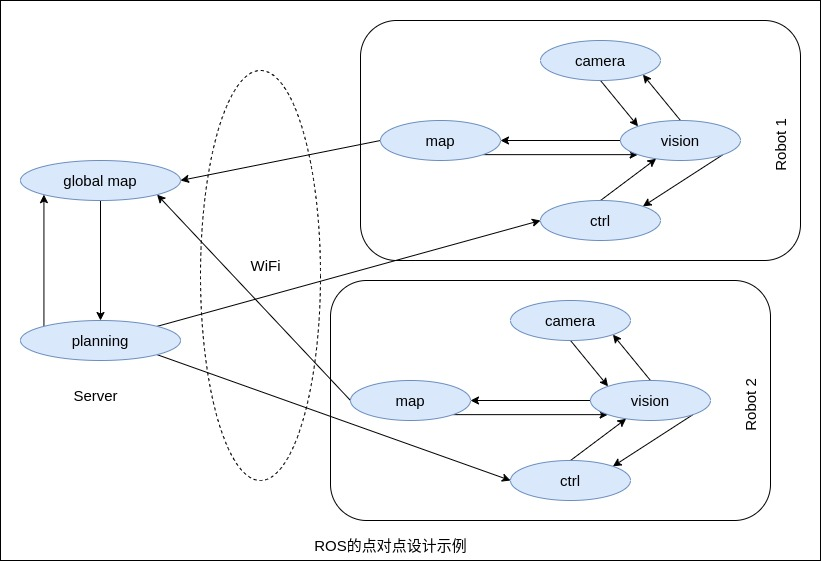

ROS 是开源的，是在机器人系统之上的一种后操作系统，或者说次级操作系统。它提供类似操作系统所提供的功能，包含硬件抽象描述、底层驱动程序管理、共用功能的执行、程序间的消息传递、程序发行包管理等。同时，它也提供一些工具和程序库用于获取、建立、编写和运行多机整合的应用。

ROS 的运行架构是一种使用 ROS 通信模块实现模块间 P2P 的松耦合的网络连接的处理架构，支持若干种类型的通信，包括基于服务的同步 RPC(远程过程调用)通信、基于 Topic 的异步数据流通信，还包括参数服务器上的数据存储，但是 ROS 本身不具备实时性。更多[通信类型](通信类型.md)信息。

### 主要特点

ROS 的主要特点可以归纳为以下几条。

1 点对点设计

一个使用 ROS 的系统包括一系列进程，这些进程存在于多个不同的主机并且在运行过程中通过端对端的拓扑结构进行联系。虽然一些基于中心服务器的软件框架也具备多进程和多主机的优势，但是在这些框架中，当各主机通过不同的网络进行连接时，中心服务器就会发生问题。

ROS 的点对点设计以及服务和节点管理器等机制可以分散由计算机视觉和语音识别等功能带来的实时计算压力，适应大多数机器人遇到的计算挑战。

2 多语言支持

ROS 被设计成语言中立性的框架结构，支持多种主流编程语言，例如 C++、Python、Java、JavaScript 等。

ROS 的特殊性主要体现在消息通信层，其利用 XML-RPC 机制实现端到端的连接和配置。XML-RPC 也实现了大多数主流编程语言的合规描述。

为了支持交叉语言，ROS 利用了简单的、语言无关的接口定义语言去描述模块之间的消息传送。接口定义语言使用了简短的文本去描述每条消息的结构，也允许消息的合成。每种编程语言的代码生成器都会产生类似本编程语言的目标文件，在消息传递和接收的过程中通过 ROS 实现自动连续并行运行。

这里查看关于[生成C++目标文件示例说明](生成文件.md)。

在编写 ROS 应用过程中，可利用基于 ROS 代码库中包含的超过 400 种消息类型，这些消息适配传感器传送数据使用，使 ROS 系统可轻易获得周围环境信息。

3 精简与集成

ROS 建立的系统具有模块化的特点，各模块中的代码可以单独编译，而且编译使用的 CMake 工具使其自始至终贯彻精简的理念。ROS 系统将复杂的代码实现封装在各个库中，并创建了一些短小精干的应用程序以显示 ROS 库的功能。这种方式允许对 ROS 的代码进行简单移植并利用于任何新系统中。另一个巨大优势在于，对代码的单元测试也变得较为容易，一个独立的单元测试程序可以测试代码库中很多的特性。

4 工具包丰富

为了管理复杂的 ROS 软件框架，开发者利用大量的小工具去编译和运行多种多样的 ROS 组件，以维持一个精简的内核，避免去构建一个庞大的开发和运行环境。

这些小工具主要担负的任务有，组织源代码的结构、获取和设置配置参数、图形化端对端的拓扑连接、测量频带使用宽度、即时描绘信息数据、自动生成文档等。

5 免费并且开源

### 缺陷

1 ROS 作为一个通用框架并未与自动驾驶现有的硬件、OS 等底层进行定制，有着较大的优化空间。

2 ROS 软件包既繁且重，学习和使用成本较高。部署统一的开发、运行环境较为麻烦。

3 基于 ROS 的整体系统分散为大量的独立进程，集成度较低。系统的 CPU、GPU 以及内存等资源全部由各模块抢占，缺乏全局的分配调度系统。
