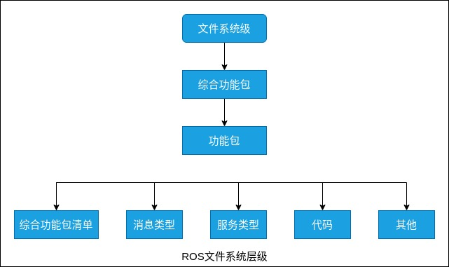
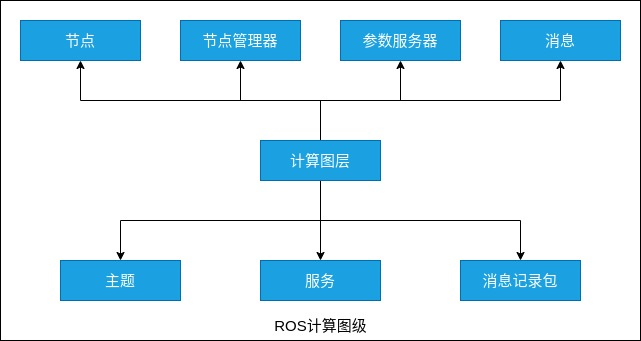
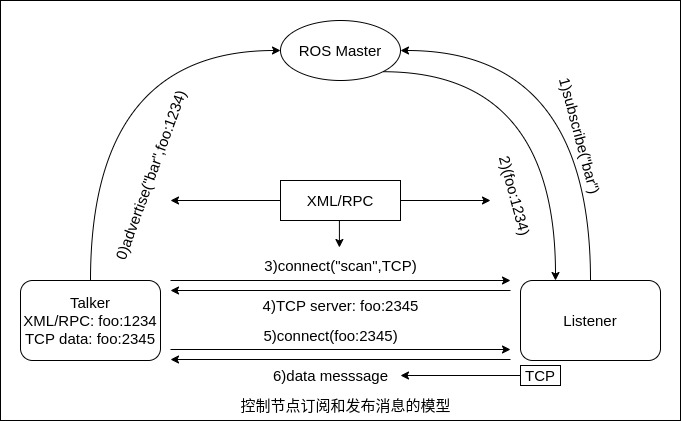
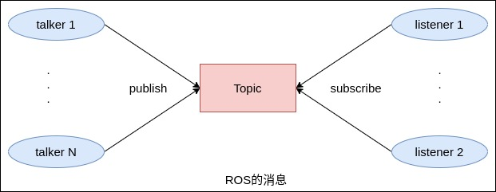

根据 ROS 系统代码的维护者和分布者来标示，ROS 主要有两大部分。
- main: 核心部分，主要由 Willow Garage 公司和一些开发者设计、提供以及维护。它提供了一些分布式计算的基本工具，以及整个 ROS 核心部分的程序。
- universe: 全球范围的代码，由不同国家的 ROS 社区组织开发和维护。

如果从另一个角度对 ROS 分级，主要可分为 3 个级别: 计算图层、文件系统层、社区级。具体如下。

### ROS 文件系统层

在 ROS 系统中，不同程序组件需要根据功能放在不同的文件夹下。ROS 文件系统层如下图所示。

- 功能包(Package): 一个功能包具有用于创建 ROS 代码的最小结构和最少内容，是 ROS 中软件组织的基本形式。一个 Package 包含节点(ROS runtime processes)、ROS程序库(ROS-dependent library)、数据集(datasets)、配置文件(configuration)等。
- 综合功能包(Metapackage): 综合功能包是一组具体的服务相关的功能包。
- 综合功能包清单(Metapackage manifest): 描述一个 package 的元信息，包括 package 的名字、版本、功能简述、证书信息、依赖关系等。
- 消息类型(Message type): 消息是一个进程发送到其他进程的信息。ROS 系统有很多的标准类型消息，存储在 Message 文件中。
- 服务类型(Service type): 服务描述说明定义了 ROS 服务通信中请求和响应的数据结构，存储在 Service 文件中。

### 计算图层

计算图层是 ROS 在点对点网络里整合并处理数据的过程。基本计算图层概念包括节点、节点管理器(也称为控制器)、参数服务器、消息、服务、主题和消息记录包。如下图所示。

计算图层是 ROS 处理数据的一种点对点的网络形式。程序运行时，所有进程以及它们所进行的数据处理，都将会通过一种点对点的网络形式表现出来。这一级主要包括几个重要概念: 节点(node)、消息(message)、主题(topic)、服务(service)，

1) 节点(Node)

节点是主要的执行进程。一个机器人控制系统通常由很多节点组成。例如一个节点处理雷达点云、一个节点执行定位、一个节点执行路径规划。节点需要使用 ROS 客户端编写，如 roscpp 或 rospy 。

2) 节点管理器(ROS Master)

节点管理器给 ROS 的节点存储了主题和服务的注册信息。节点与管理器通信报告它们的注册信息。当这些节点与管理器通信的时候，它们可以接收关于其他已注册节点的信息，并且建立与其他已注册节点之间的联系。当这些注册信息改变时管理器也会回馈节点，同时允许节点动态创建与新节点之间的连接。

节点管理器用于在计算图层中注册或查找节点名称。如果没有节点管理器，就不会有节点、消息、服务之间的通信。

节点与节点之的连接是直接的，管理器仅仅提供了查询信息，就像一个 DNS 服务器。节点订阅一个主题会要求建立一个与发布该主题的节点的连接，并且将会在同意连接协议的基础上建立该连接。

3) 参数服务器(Parameter Server)

参数服务器能够使数据通过关键词存储在系统的核心位置，它是可通过网络访问的共享、多变量字典。节点使用此服务器来存储和检索运行时的参数，适合存储静态、非二进制的配置参数，不适合存储动态配置的数据。

4) 消息(Message)

节点之间通过传送消息进行通信。如下图表示。每一个消息都是一个严格的数据结构。常见的标准数据类型(如整型、浮点型、布尔型等)都是支持的，同时也支持原始数组类型。消息可以包含任意的嵌套结构和数组。

消息使用编程语言无关的 .msg 文件定义，编译过程中生成对应的代码文件。

5) 主题

消息以一种发布/订阅的方式传递。一个节点可以在一个给定的主题中发布消息。一个节点可以订阅某个主题，接收该主题上来自其他节点的消息。一个主题内可以同时由多个节点订阅和发布消息，一个节点也可以订阅多个主题或者发布消息到多个主题内。消息的订阅者和发布者之间互相解耦，无须知道对方的存在。主题的名称不能重复，以避免同名主题产生消息路由错误。

6) 服务

当需要从某一个节点获得一个请求或应答时，就不能依靠主题来实现了。但是，服务可以允许直接与某个节点交互。服务由一对消息结构定义，一个用于请求，另一个用于应答。

服务使用编程语言无关的 .srv 文件定义请求和应答数据结构，编译过程中生成对应的代码文件。

主题与服务的区别如下。

| | 主题 | 服务 |
|:-----|:------|:-------|
| 同步性 | 异步 | 同步 |
| 通信模型 | 发布/订阅 | 服务器/客户端 |
| 底层协议 | ROSTCP/ROSUDP | ROSTCP/ROSUDP |
| 反馈机制 | 无 | 有 |
| 缓冲区  | 有 | 无 |
| 实时性 | 弱 | 强 |
| 节点关系 | 多对多 | 一对多(一个server) |
| 适用场景 | 数据传输 | 逻辑处理 |
